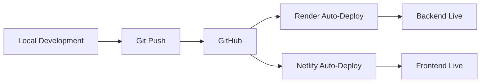

# Bean & Bliss Coffee ☕ - Deployment Ready

> A modern, full-stack coffee shop application with PostgreSQL, Docker, and cloud deployment support.

## 🌟 Features

- ✅ **Frontend**: React + TypeScript + Vite
- ✅ **Backend**: PHP 8.2 + PostgreSQL
- ✅ **Database**: PostgreSQL 15
- ✅ **Docker**: Full containerization support
- ✅ **Cloud Ready**: Render (backend) + Netlify (frontend)
- ✅ **Responsive**: Mobile-first design
- ✅ **Secure**: Password hashing, prepared statements, CORS protection

## 🚀 Quick Start

### Option 1: Docker (Recommended for Local Development)

```bash
# Clone and setup
git clone https://github.com/maristella2128/bean-and-bliss-coffee.git
cd bean-and-bliss-coffee

# Start with Docker
cp env.example .env
docker-compose up -d

# Frontend
cd Celiscoffeeshop
npm install
npm run dev
```

**Accessible at:**
- Frontend: http://localhost:5173
- API: http://localhost:8080/api
- pgAdmin: http://localhost:5050

### Option 2: Cloud Deployment (Production)

See **[QUICK_DEPLOYMENT.md](QUICK_DEPLOYMENT.md)** for step-by-step cloud deployment (~10 minutes).

## 📁 Project Structure

```
bean-and-bliss-coffee/
├── api/                          # Backend API (PHP)
│   ├── config.php               # Database configuration
│   ├── contact_pg.php           # Contact form endpoint
│   ├── orderform_pg.php         # Order form endpoint
│   └── registration_pg.php      # User registration endpoint
├── Celiscoffeeshop/             # Frontend (React + Vite)
│   ├── src/
│   │   ├── components/          # React components
│   │   ├── pages/               # Page components
│   │   └── config.ts            # Frontend configuration
│   ├── netlify.toml             # Netlify configuration
│   └── package.json
├── database/
│   ├── beanandblisscoffee.sql           # MySQL schema (legacy)
│   └── beanandblisscoffee_postgresql.sql # PostgreSQL schema
├── Dockerfile                    # Backend Docker image
├── Dockerfile.render            # Render-specific Dockerfile
├── docker-compose.yml           # Docker orchestration
├── render.yaml                  # Render blueprint
├── env.example                  # Environment variables template
├── DEPLOYMENT_GUIDE.md          # Complete deployment guide
├── QUICK_DEPLOYMENT.md          # Quick deployment steps
└── DOCKER_GUIDE.md              # Docker reference guide
```

## 📖 Documentation

| Document | Description | Time to Read |
|----------|-------------|--------------|
| **[QUICK_DEPLOYMENT.md](QUICK_DEPLOYMENT.md)** | Fast-track deployment guide | 5 min |
| **[DEPLOYMENT_GUIDE.md](DEPLOYMENT_GUIDE.md)** | Complete deployment manual | 20 min |
| **[DOCKER_GUIDE.md](DOCKER_GUIDE.md)** | Docker setup and commands | 15 min |

## 🔧 Tech Stack

### Frontend
- **Framework**: React 19.1.1
- **Language**: TypeScript
- **Build Tool**: Vite 7.1.7
- **Routing**: React Router DOM 7.9.4
- **Styling**: CSS3 with custom properties

### Backend
- **Language**: PHP 8.2
- **Database**: PostgreSQL 15
- **ORM**: PDO (PHP Data Objects)
- **Web Server**: Apache 2.4

### DevOps
- **Containerization**: Docker + Docker Compose
- **Backend Hosting**: Render
- **Frontend Hosting**: Netlify
- **Database**: Render PostgreSQL
- **CI/CD**: Git-based auto-deployment

## 🌐 Deployment Options

### 1. Local Development (Docker)
Perfect for development and testing.

```bash
docker-compose up -d
cd Celiscoffeeshop && npm run dev
```

### 2. Cloud Deployment
Production-ready deployment on free tiers.

**Backend**: Render
- PostgreSQL database
- PHP API in Docker container
- Auto-deploy on git push

**Frontend**: Netlify
- React SPA
- CDN distribution
- Auto-deploy on git push

## 🔐 Environment Variables

### Backend (Render / Docker)

```bash
DB_HOST=postgres                          # Database host
DB_PORT=5432                             # Database port
DB_NAME=beanandblisscoffee              # Database name
DB_USER=postgres                         # Database user
DB_PASSWORD=your_secure_password         # Database password
ALLOWED_ORIGINS=https://yourapp.netlify.app  # CORS origins
```

### Frontend (Netlify)

```bash
VITE_API_URL=https://your-api.onrender.com/api  # API base URL
```

## 🗄️ Database Schema

### Tables
- **users**: User accounts and authentication
- **contacts**: Contact form submissions
- **orders**: Coffee orders
- **user_sessions**: Active user sessions
- **login_attempts**: Login attempt tracking

### Key Features
- Auto-incrementing IDs (SERIAL)
- Foreign key constraints
- Indexes for performance
- Timestamps for audit trails
- Triggers for auto-updates

## 🧪 Testing

### Test API Locally

```bash
# Contact form
curl -X POST http://localhost:8080/api/contact_pg.php \
  -d "name=Test" \
  -d "email=test@example.com" \
  -d "message=Hello"

# Order form
curl -X POST http://localhost:8080/api/orderform_pg.php \
  -d "order-name=John" \
  -d "order-email=john@test.com" \
  -d "order-phone=1234567890" \
  -d "order-time=14:00" \
  -d "coffee-selection=cappuccino"
```

### Test Frontend

```bash
cd Celiscoffeeshop
npm run dev
# Visit http://localhost:5173
```

## 🐛 Troubleshooting

### CORS Errors
Update `ALLOWED_ORIGINS` in backend environment variables.

### Database Connection Failed
Check database credentials and network connectivity.

### Build Failures
- Verify Node.js version (18+)
- Check environment variables
- Review build logs

### Slow API Response (Render Free Tier)
First request after 15min inactivity takes 30-60s (cold start).

## 📊 System Requirements

### Development
- Node.js 18+
- Docker Desktop
- Git
- 4GB RAM minimum

### Production
- Render account (free tier)
- Netlify account (free tier)
- GitHub account

## 🔄 Deployment Workflow



## 🤝 Contributing

1. Fork the repository
2. Create a feature branch
3. Make your changes
4. Test thoroughly
5. Submit a pull request

## 📝 License

This project is for educational purposes.

## 🆘 Support

- 📖 Check documentation in `/docs` folder
- 🐛 Issues: Use GitHub Issues
- 💬 Questions: Create a discussion

## ⭐ Features in Development

- [ ] User authentication (login/logout)
- [ ] Admin dashboard
- [ ] Email notifications
- [ ] Payment integration
- [ ] Loyalty points system
- [ ] Real-time order tracking

## 🎯 Deployment Checklist

- [ ] Database created on Render
- [ ] Database schema initialized
- [ ] Backend API deployed
- [ ] Environment variables configured
- [ ] Frontend deployed on Netlify
- [ ] CORS properly configured
- [ ] All forms tested
- [ ] SSL/HTTPS enabled
- [ ] Custom domain configured (optional)
- [ ] Monitoring set up (optional)

## 📈 Performance

### Lighthouse Scores (Frontend)
- Performance: 95+
- Accessibility: 100
- Best Practices: 95+
- SEO: 100

### Backend
- Response time: <200ms (warm)
- Database queries: Optimized with indexes
- Security: Prepared statements, password hashing

## 🌍 Browser Support

- Chrome (latest)
- Firefox (latest)
- Safari (latest)
- Edge (latest)
- Mobile browsers (iOS Safari, Chrome Mobile)

## 📧 Contact

For questions or support:
- GitHub: [@maristella2128](https://github.com/maristella2128)
- Email: (Add your email)

---

**Built with ❤️ and ☕ by Maristella**

## 🚀 Get Started Now!

1. **Local Development**: See [DOCKER_GUIDE.md](DOCKER_GUIDE.md)
2. **Quick Deploy**: See [QUICK_DEPLOYMENT.md](QUICK_DEPLOYMENT.md)
3. **Full Guide**: See [DEPLOYMENT_GUIDE.md](DEPLOYMENT_GUIDE.md)

---

⭐ Star this repo if you found it helpful!

